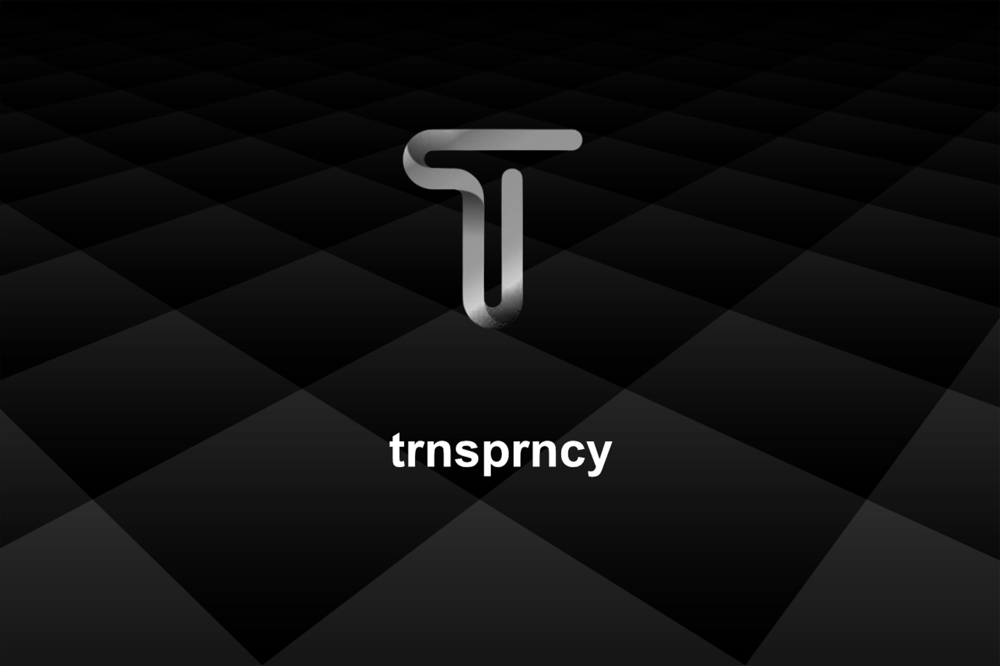

# Trnsprncy
A modern easy-to-use [Google Tag Manager](https://marketingplatform.google.com/about/tag-manager/) component optimized for Next.js applications.

- [Compliant with Consent Mode v2](https://developers.google.com/tag-platform/security/concepts/consent-mode)
- GDPR | ePrivacy | CCPA | UK GDPR

---

## What is Trnsprncy

**rnsprncy** simplifies cookie consent management for developers at its core. As fellow developers who’ve grappled with the intricacies of optimizing Google Tag Manager and addressing performance issues in our applications, we deeply understand the challenge. The repetitive task of re-implementing the same cookie consent pattern across multiple applications can be exhausting.

**trnsprncy** offers an optimal open-source solution to one of the most significant challenges in building performant web applications. By using **trnsprncy**, you can focus on your core business logic without being bogged down by the complexities of varying international cookie compliance guidelines. It’s time to streamline your cookie consent process and ensure a seamless user experience.




## Dependencies

- [cookies-next](https://github.com/andreizanik/cookies-next)
- [@next/third-parties](https://github.com/vercel/next.js/tree/canary/packages/third-parties) by [GoogleChromeLabs/third-party-capital](GoogleChromeLabs/third-party-capital)


## Installation

```bash
npm install @trnsprncy/oss
```


## Usage

```tsx
// app/layout.tsx


import ConsentProvider from '@trnsprncy/oss';

export default function RootLayout({
  children,
}: Readonly<{
  children: React.ReactNode;
}>) {
  return (
    <html lang="en">
      <body>
          {children}
        
          <TrnsprncyProvider
          consentCookie="app-consent"
          essentialTags={[
            "functionality_storage",
            "personalization_storage",
          ]}
        >
          <Banner/> // use any banner component or the @trnsprncy/ui kit
        </TrnsprncyProvider>

      </body>
    </html>
  );
}
```


## Props

| Name          | Default         | required | Description                                                  |
| ------------- | --------------- | -------- | ------------------------------------------------------------ |
| consentCookie | `'app-consent'` | **no**   | key name of the cookie used to manage user's consent         |
| essentialTags | `undefined`     | **yes**  | array of google consent tags for personalization and functionality storage consent |
| analyticsTags | `undefined`     | **no**   | array of google consent tags for ads, analytics and monitoring related storage consent. |
| enabled       | `true`          | **no**   | globally enable or disable the `TrnsprncyProvider`       |
| redact        | `true`          | **no**   | adds the global `'ads_data_redaction'` consent which redacts all sensitive user related data from the tracking data. |
| dataLayerName | 'dataLayer'     | **no**   | sets the name used for the dataLayer object added by google tag manager to the user's window object. |
| gtagName      | 'gtag'          | **no**   | sets the name used for the gtag function that is used to handle the user's google-tag-manager consent. |


## Roadmap

- [ ] Add support for 3rd party/custom const tags.
- [ ] internationalization ([i8n](https://en.wikipedia.org/wiki/Internationalization_and_localization))

